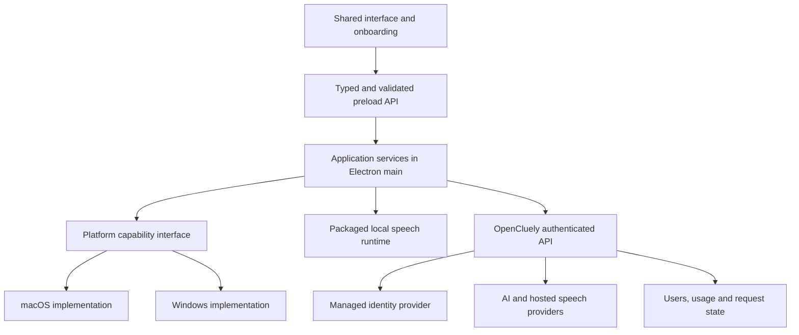

# OpenCluely: Windows and macOS product design

Status: engineering design with Stage 0 packaging work in progress, 2026-09-22. Windows unsigned build/startup checks have run; full packaged platform qualification is not complete.

## Implementation progress

Stage 0 now has portable Node build/start/clean commands, a pinned Electron 44.4.4 candidate, Windows x64 and Mac x64/arm64 packaging configuration, architecture-specific Mac helper builds, signing prerequisites, three-platform CI, draft-only release preparation and artifact/update verification. [BUILDING.md](BUILDING.md) documents the commands and remaining gates; [CROSS-PLATFORM-REVIEW.md](CROSS-PLATFORM-REVIEW.md) records independent review findings and corrections.

The Windows packaged startup check exercises the actual main process and all five renderer/preload surfaces with an isolated profile. It does not establish interactive feature parity. Mac native compilation, signed/notarized execution, Windows signed installation/upgrades and OS boundary testing remain Stage 0 gates. Managed sign-in/AI, bundled local speech and native parity work remain unimplemented by this change. Every feature below is still required before release.

## Product contract

The user requires every existing feature on both Windows and macOS before the cross-platform release. Users sign in and OpenCluely provides AI. Setup must require as little technical work as possible.

Full parity means equivalent observable outcomes, including existing advanced behavior, not identical native APIs. An unavailable required feature blocks release for that target. An internal partial build can support development but cannot be marketed as the completed cross-platform product. Optional use does not mean optional implementation: local transcription and specialized modes remain required capabilities even when a user does not enable them during onboarding.

Do not silently remove provider selection, local speech, advanced window behavior or existing modes to simplify setup. Do not interpret current README claims as proof that the Mac implementation achieves them universally. First establish the actual baseline and distinguish working behavior, defects and unverified claims. Preserve the requested scope; an unsatisfied requirement remains an explicit blocker.

The normal experience is download, install, sign in, enable the desired capabilities, and complete a real first action. Advanced capabilities can require additional OS permissions or elevation; those prompts cannot be promised away. No user installs Node, Python, pip, Homebrew, a compiler, or modifies PATH.

## Architecture

Keep Electron and the existing HTML/JavaScript interface. Add focused boundaries incrementally rather than rewriting the application.

Retain shared prompt loading, skill selection, conversation processing, renderer audio capture and rendering where their contracts pass. Move provider network execution behind our API for managed accounts. Preserve compatible advanced BYOK behavior as an opt-in setting; it is never a first-run requirement and user-owned provider keys must not be uploaded to our backend. Managed sessions must work with no provider keys on the computer.

The renderer never receives managed access/refresh tokens or operator provider credentials. Main-process services perform authenticated requests and expose only narrow actions and response events. Validate sender, parameters and event subscription cleanup. Retain context isolation and disabled Node integration; verify sandbox compatibility with the selected Electron version. These boundaries follow [Electron's security guidance](https://www.electronjs.org/docs/latest/tutorial/security).

### Source inventory and parity requirements

The table inventories product behavior exposed by the current UI, preload, main process, service code and documentation. All rows require resolution and tests on both targets; grouping does not remove subordinate controls. Appendix A records the IPC/settings surface so the inventory can be checked against source changes.

| ID | Existing behavior and source | Proposed shared/platform boundary | Required acceptance evidence |
|---|---|---|---|
| P01 | Text chat, streaming and interruption; `chat.html`, `llm.service.js` | Shared chat/session contract and managed API | Stream ordering, partial response, retry/cancel and error display; no duplicate answers |
| P02 | Screenshot/vision answer, display and region selection; `capture.service.js`, `main.js` | Shared capture workflow; platform source and coordinate mapping | Correct display and region; identical monitors, mixed DPI, rotation and disconnect; invalid crop never sends a larger image |
| P03 | Six skills: DSA, OOD, MCQ, system design, behavioral, programming; `prompts/` | Shared versioned prompt/skill catalog | Each skill works for text, image and transcription; changes synchronize across windows |
| P04 | Coding language: C++, C, Python, Java, JavaScript; `settings.html` | Shared settings and request context | Applicable skills receive selected language and preserve it across restart |
| P05 | Gemini/DeepSeek selection, model fallback and diagnostics; `llm.service.js`, `deepseek.client.js` | Managed provider adapters; separate optional direct-key adapter | Each exposed provider choice remains functional; supported input types verified; failures are not presented as successful AI output |
| P06 | Session history, context, compression and clearing; `session.manager.js` | Shared session store | Existing context behavior maintained; clear invalidates in-flight results; persistence policy stated, not inferred from a config flag |
| P07 | Cloud microphone recognition and interim/final text; `speech.service.js` | Shared renderer audio and managed streaming speech adapter | Real microphone, interim/final ordering, stop, device loss and recovery; no user Azure credentials required |
| P08 | Local Whisper, model/language/device selection; installer/worker/speech services | Bundled runtime per OS/architecture and managed model downloads | Offline transcription after initial download; settings and model availability; CPU works without GPU or system Python |
| P09 | Manual recording, automatic VAD, segmentation, transcript-to-answer and output targets; speech and main UI | Shared recording state and audio protocol | Manual stop flushes once; VAD preserves utterances; chat/overlay/both route correctly; cancellation stops upload and late results |
| P10 | Config-gated text-to-speech with voice/rate; `speech.service.js:speak` | Platform speech adapter | Establish reachability on Mac, preserve existing callable behavior; equivalent voice/rate semantics, not identical voice names |
| P11 | Overlay, chat, answer panel, settings and onboarding surfaces; `window.manager.js` | Shared window lifecycle; platform presentation adapter | Chat/panel/both answers, loading, show/hide, close/reopen and quit operate consistently |
| P12 | Click-through/interactive modes, move/resize, bound windows and gap | Shared geometry rules; platform window adapter | Mouse routing, movement and resize; no off-screen windows after display changes |
| P13 | Always-on-top, current desktop/full-screen placement, display tracking and geometry freeze | Platform window adapter | Actual behavior across desktops, full-screen apps and displays; test focus effects explicitly |
| P14 | Global shortcuts, configurable capture chord, collision handling and help | Shared action registry; platform shortcut adapter | Every existing action; Cmd/Ctrl conventions; occupied chord recovery; one action per keypress; persisted chord equals registered chord |
| P15 | Focusless input/capture mode, palette routing, modifier and editing behavior; `capture-routing.js`, Swift helper | Shared semantic input events; distinct native input adapter | Mac baseline replayed on Windows; composition/layout, editing, enter/escape, modifier cleanup, helper exit and focus effects |
| P16 | Capture exclusion/content protection and screen-sharing behavior; `window.manager.js` | Platform presentation capability plus external compatibility tests | Recorded output from each supported capture path/application; setter success alone is insufficient |
| P17 | Icon/appearance choices, app identity behavior, Dock/taskbar presentation and restart | Platform appearance adapter with stable storage/signing identity | Preserve each existing observable choice; verify installer, permission and update identity remain stable; unresolved conflicting behavior blocks release |
| P18 | Existing root-mode lifecycle, launcher status/doctor/stop and privileged operation; root-mode docs/scripts | Separate feasibility requirement; no assumed Windows equivalent | Document exact observable requirement, permission/install impact and platform evidence; do not equate Windows administrator with macOS root |
| P19 | Optional shield mode, arm/restore, helper status, answer relay, hotkey handoff and fallback surface | Versioned helper lifecycle and authenticated IPC contract; implementation subject to feasibility | Every transition, duplicate arm, helper absence/crash, restore, answer routing and competing modes; no silent loss of chat/microphone/history |
| P20 | First run, key settings, connection diagnostics, speech install/model management, configuration persistence | Shared setup, credential and configuration services | Managed sign-in path plus retained advanced settings; recoverable failures and restart without losing progress |
| P21 | Logs, support diagnostics and existing regression/forensic tooling | Shared diagnostic event schema; platform tooling adapters where OS-dependent | User diagnostics redact content and secrets; existing diagnostic outcomes inventoried and preserved, with privileged tooling explicitly distinguished from routine setup |

Internal test endpoints are retained for regression coverage, gated off in shipped builds. The scanner, build/install scripts and legacy web scaffold are included in the engineering inventory; they are not evidence of an existing managed backend. Any currently shipped user-facing function discovered through them must be added to the parity table, not excluded because it is outside `src/`.

### Feasibility gates before broad implementation

P15-P19 are release-critical investigations, not deferred features. First characterize them on a packaged Mac baseline and an isolated Windows prototype, using documented OS interfaces. The previous root launch and native helper are not directly portable. Windows services run in a separate session from the interactive desktop; a service is not a drop-in GUI replacement. See [Microsoft interactive services documentation](https://learn.microsoft.com/en-us/windows/win32/services/interactive-services).

Universal capture invisibility cannot be promised from the current API: Electron documents that ScreenCaptureKit-based Mac applications can capture a window despite content protection, and Microsoft states that display affinity is not a universal protection guarantee. See [Electron BrowserWindow](https://www.electronjs.org/docs/latest/api/browser-window#winsetcontentprotectionenable-macos-windows) and [Microsoft display affinity](https://learn.microsoft.com/en-us/windows/win32/api/winuser/nf-winuser-setwindowdisplayaffinity). Record this as a known limit against any universal requirement. Compatibility with specific environments must have an explicit versioned test scope; a narrower scope must not silently substitute for the user's full requirement.

The feasibility result for each advanced behavior is demonstrated, unproven, or unsupported under the tested constraints. A failed or unsupported result blocks the full-parity release and returns a concrete product decision. Do not claim a native rewrite will necessarily solve it, introduce privileged installation without explaining it, or ship a disabled feature as parity.

For P18/P19, the observable outcome includes continued chat/history, input, microphone, settings, screenshot-to-answer, mode status and orderly stop/restore in the environments where the current product claims them. Merely preserving a launcher name or a surviving helper process does not pass. Record each scenario as `{ OS/build, CPU, application build, interacting application/version, user privilege, permission state, active mode, action, expected outcome, observed outcome }`. Cover ordinary operation, foreground/full-screen changes, helper/GUI termination, competing mode activation, restart, and permission revocation. Validate the complete user workflow after each transition; a fallback window showing the last answer is not equivalent to an operational full interface. Existing historical reports contain both successes and failures and are baseline evidence, not blanket qualification. The Windows architecture and the Mac packaged privilege/permission model remain open until these scenarios pass.

## Platform capability contract

Introduce `src/platform/index.js`, `shared.js`, `darwin.js`, and `win32.js`. Selection happens once from main-process OS/architecture information, not renderer user-agent guesses. Helpers implement a versioned handshake and report architecture and capability support; incompatible helpers fail explicitly.

Expose narrow operations: `probeCapabilities`, `requestPermission`, `openPermissionSettings`, `listDisplays`, `captureRegion`, `registerShortcut`, `setWindowMode`, `startInputSession`, `stopInputSession`, and helper lifecycle/status. Keep privileged operations separate from the GUI and provider network access if feasibility establishes a need; their exact authority is a separate design gate. Never run the entire networked application elevated merely to reuse the current launcher.

A non-elevated GUI is the preferred architecture, not evidence that the existing privileged-mode outcomes have been preserved. If an equivalent supported implementation cannot meet them, P18/P19 remain blockers and the architecture must be reconsidered explicitly; do not substitute a weaker standard-user mode.

Each capability reports `{ availability, permission, health, reason, recoveryAction, checkedAt }`. Availability is supported/unsupported/unknown; permission is granted/not-requested/denied/restricted/not-applicable; health is untested/testing/ready/failed. Optional assets have their own state. These axes must not be collapsed into one persisted `ready` flag.

Capture contracts carry an explicit display identity, display-local logical rectangle, layout revision and actual image pixel dimensions. Resolve the source by display identity and map to image pixels using observed dimensions; validate bounds and layout again before capture. If identity disappears, scaling changes during selection or crop fails, ask for selection again. Do not silently select the primary monitor or expand to full-screen. Remove the implicit left-half assumption from the general capture path; preserve an intentional left-half preset if required by the Mac baseline.

For input, send semantic keys/text/modifiers to shared routing. Do not expose macOS key codes/flags as the cross-platform protocol. Helper crashes must end the input session and restore ordinary input state. Add genuine native-input tests; JavaScript event simulation cannot prove focusless input parity.

## Setup and user recovery

The app offers a guided first action after sign-in. Request screen permission for capture, microphone permission for voice, and advanced permissions when enabling the associated feature. All required features remain available to enable later. Provide a setup status page for the complete feature set, with specific pending actions.

Persist only onboarding progress, preferences and verified asset metadata. Recheck permissions at launch, on returning from OS settings and immediately before feature use. Separate overall onboarding completion from current feature readiness. Never require a local provider key to mark managed onboarding complete.

| Condition | User experience and system behavior |
|---|---|
| Signed out / session revoked | Sign-in action; preserve drafts and nonsecret settings; stop new managed requests |
| Access token expired | One coordinated refresh in main; on failure return to sign-in without looping |
| Screen permission denied/restricted | Explain affected feature; open the appropriate settings or show policy restriction; allow other features; no claim that capture passed |
| Microphone denied or unplugged | Stop recording, show recovery/device choice; capture and chat remain usable |
| Shortcut occupied | Offer another binding; commit settings only after registration succeeds; retain old binding on failure |
| Advanced permission/elevation needed | Explain purpose and required action; user may enable later; denial is a runtime state, not release parity evidence |
| Offline / service outage | Keep local features and drafts; show retry action; do not secretly switch local audio to cloud or call an empty fallback a successful answer |
| Optional runtime/model absent | In-app install with size/progress/cancel/resume; user can use cloud speech meanwhile |
| Asset corrupted / disk full | Verify integrity and free space; clean only app-owned staging files; retry without a terminal |
| Secret storage unavailable | Offer session-only sign-in or retry secure storage; never persist tokens in plaintext |
| Relaunch required | Explain why, preserve progress/drafts, resume the relevant check; do not repeat the whole wizard |

A screenshot/chat health check and a transcription check require actual usable output, not the presence of binaries or a successful permission query. Permission previews use a sample or user-selected region and explicitly disclose upload. Routine future captures need not repeat the preview once the user has chosen the behavior.

## Managed identity and AI service

Use an external-browser authorization-code flow with PKCE, state validation and a registered callback bound to the initiating app session. Verify callback identity, single use and expiry; keep client secrets out of the desktop package. A loopback callback or registered app URI must be selected and tested on both packaged targets, including when the app is already running. This follows [OAuth for native applications](https://www.rfc-editor.org/rfc/rfc8252).

Prefer a managed identity provider and a small authenticated API with durable request/usage storage. Hosting vendor and identity provider are deployment choices still to be selected; no service exists merely because the desktop has provider SDKs. Keep provider adapters separate so prompt/stream behavior can be preserved and tested against the Mac baseline.

Store refresh credentials encrypted through OS-backed storage and keep access tokens in main-process memory. Use the API supported by the selected Electron version. Secure storage protections differ by OS and do not protect against every process running as the same user. See [Electron safeStorage](https://www.electronjs.org/docs/latest/api/safe-storage).

| Proposed API | Contract |
|---|---|
| `GET /v1/me` | Account, entitlements, usage/limit status and supported service features |
| `POST /v1/answers` | Authenticated request containing skill, language, provider preference, bounded history and text/image input; returns a durable request ID |
| `GET /v1/requests/:id/events` | Authenticated SSE with monotonic event IDs: accepted, delta, completed, failed; reconnect from last event without starting generation again |
| `GET /v1/requests/:id` | Recover current/final state after interrupted delivery; check account ownership |
| `POST /v1/requests/:id/cancel` | Idempotent cancellation; stop further delivery and cancel upstream where supported; acknowledge possible already-incurred usage |
| `POST /v1/speech/sessions` | Managed live transcription session with sequenced audio and interim/final events; preserves current cloud speech behavior |
| `POST /v1/transcriptions` | Bounded recorded/VAD segments; use segment IDs to deduplicate finalized text |
| Session revocation / account deletion | Identity-provider integration plus deletion of application-held data; all endpoints enforce account ownership |

Mutating generation/transcription requests require an idempotency key scoped to account, operation and payload hash. Reject reuse with different payload. A durable request record and atomic usage reservation precede provider dispatch. Reconnects retrieve the same request and do not charge again. If dispatch outcome is unknown after a crash, reconcile if the provider supports it; otherwise show an interrupted state rather than automatically dispatching again. Do not promise exactly-once execution from a provider that lacks it. Retain deduplication metadata longer than replayable answer content and do not regenerate on an expired replay record.

Use explicit error codes for authentication, quota, unsupported input, excessive payload, unavailable provider and timeout. Specify request/body/audio-duration/output limits in the service contract before implementation. Rate/concurrency/cost limits are server-enforced. Model/provider fallback must respect supported modalities and user selection; never switch after emitting partial text without marking a new attempt.

### Streaming, cancellation and account boundaries

For live speech, `POST /v1/speech/sessions` returns an account/session-bound speech ID, an expiry and a same-service WSS endpoint. Main opens the connection using an authorization header; no reusable token appears in a URL or renderer. Authenticate connection and ownership, enforce expiry/revocation while connected, and negotiate codec/sample rate/channel count and byte/duration limits before accepting audio. Audio frames carry session ID and monotonic sequence; the server acknowledges the highest contiguous accepted sequence. An acknowledgement means receipt, not a finalized transcript. Duplicate frames within a live session are ignored. Final transcript events carry stable segment IDs, with monotonically numbered revisions for interim text.

Bound unacknowledged audio to ten seconds by default, with lower server-advertised bounds honored. If the service cannot keep up, pause capture with a visible connection problem instead of accumulating unlimited audio or silently dropping it. Stopping sends an explicit end-of-audio marker with the last sequence; the server returns remaining final text followed by a terminal event, or a bounded timeout with an incomplete-transcript indication. Stop/cancel/expiry closes microphone tracks and audio queues locally.

On a broken transport, stop live upload, label the transcript as interrupted and offer Reconnect. Recover final transcript events from the old session by ID before starting a new session; do not automatically replay uncertain audio into a new provider session. Final segment IDs deduplicate late/recovered events. Reconnect starts a new recording interval with a visible gap marker, not a false seamless-continuation claim. Retention and acknowledgement timeouts are service configuration tested against P07; any stronger reconnect behavior actually present in the Mac baseline remains required and must extend this contract before qualification. No cloud fallback is triggered by a failed local session without user choice.

Each answer request has one durable terminal state: completed, failed or cancelled. Atomic transition from active determines the winner of a completion/cancellation race; cancel returns that winning state. Cancellation requested while dispatch is unresolved remains pending until a terminal decision or explicit interrupted failure, without silently starting another attempt. Independently, the desktop increments a local operation epoch on clear, cancel, sign-out and account switch and rejects old-epoch output, including late completed events. It may discard a completed result locally without misreporting server usage.

Bind every request and speech stream to both account and initiating authentication session. Revocation terminates delivery and new work for that session, closes active speech sessions, and requests upstream cancellation where supported; already-incurred usage may remain. Account switch immediately stops old capture/uploads, detaches old streams, clears old account-sensitive UI and invalidates local epochs before accepting new-account output. The backend still checks ownership on every request/reconnect; possession of another request ID never authorizes access. Tests cover completion versus cancel, logout during streaming, refresh failure, revocation during speech, and late events after account switch.

Proposed data policy: raw capture/audio is transient processing data, omitted from logs and deleted on completion/timeout; replayable answers expire after a short documented recovery window; usage records contain identifiers/costs, not content. Provider retention, replay duration, quotas, region and deletion SLA require a concrete deployment decision before sending real user data. Do not advertise a retention or no-training guarantee until it is verified for every configured provider. Replace the current macOS microphone description promising local Whisper when the user chooses cloud processing.

## Local speech and retained advanced settings

Local speech remains a required implemented feature on both OSes. Package a private tested runtime and its native libraries, with no reliance on machine Python, pip or FFmpeg. Choose between preserving the Python worker with a bundled environment and a native runtime only after accuracy/latency/settings compatibility measurements; changing engines cannot silently remove an existing option.

Distribute assets per OS/CPU with version, size and integrity metadata authenticated by the release channel. Download into app-owned staging; verify before atomic activation; retain a working runtime until the replacement passes an actual transcription check. Bound retries and validate free space for staging plus active assets. Interrupted downloads resume safely; cancellation and uninstall remove only owned assets according to the user's data choice.

CPU transcription is the common baseline. GPU device labels are platform-specific: CUDA cannot be promised on Mac hardware. Preserve equivalent automatic/CPU/accelerated behavior where supported and document hardware prerequisites. A literal identical-device requirement remains unresolved rather than falsely claiming CUDA parity. Local language/model/manual/VAD/response-target settings stay accessible. Bundling everything trades installer size for instant offline availability; an in-app feature download is the recommended friction compromise, not removal of offline functionality.

### Explicit disposition of current settings

| Current controls | Parity contract |
|---|---|
| `activeSkill`, `codingLanguage` | Preserve all six skills and five language values, cross-window synchronization and restart persistence (P03/P04) |
| `llmProvider` | Preserve Gemini and DeepSeek selection through managed service; advanced direct mode selects the same providers (P05) |
| `geminiKey`, `deepseekKey` | Retain optional user-key entry, validation, replacement and clear in advanced direct mode; no keys required for managed mode, no user keys sent to our service (P05/P20) |
| `speechProvider` | Preserve Azure cloud speech and local Whisper choices; managed Azure access adds operator-funded credentials, while an explicit advanced direct mode retains user Azure credentials (P07/P08) |
| `azureKey`, `azureRegion` | Preserve direct Azure key/region configuration, verification and replacement; migrate securely and keep out of ordinary settings responses and our backend (P07/P20) |
| `whisperCommand` | Preserve an optional advanced custom-executable override with argument validation, native OS path handling and a real compatibility probe; default is the packaged runtime. Do not require or silently overwrite a custom command, execute it through a shell, or assume a Mac path works on Windows (P08/P20) |
| `whisperModel`, `whisperLanguage`, `whisperDevice` | Preserve existing model/language choices and compatible custom model names, with explicit asset/device availability; automatic/CPU always supported on qualified targets and acceleration hardware-qualified (P08) |
| `whisperCaptureMode`, `whisperSegmentMs` | Preserve manual/VAD selection and the segmentation contract, including existing accepted ranges and stop/flush behavior (P09) |
| `whisperResponseTarget` | Preserve chat, overlay and both (P09/P11) |
| `shieldShowWindowCheckbox` | Preserve helper-window preference and mode transition behavior; it is not replaced by a generic overlay toggle (P19) |
| `windowGap` | Preserve value, bounds, bound-window behavior and persistence (P12) |
| `captureHotkey` | Preserve custom chord validation, live rebinding, rollback and restart behavior (P14/P15) |

Icon buttons outside the form controls remain P17; chat/panel/both answer-surface configuration remains P11; config-only text-to-speech remains P10. Credential reveal/export, if actually reachable in the baseline, needs an explicit authenticated/gesture-bound action rather than exposing all credentials through `getSettings`. Custom runtime overrides are optional advanced functionality and do not weaken the requirement that every default feature work without user-installed tools.

## Identity, persistence and migration

Choose stable installed application IDs, publisher/signing identity, update channel and storage identity before signed prototypes. Branding/display/icon choices must not change them. Audit current `app.setName` and AppUserModelID changes because they can affect OS identity and data paths.

Centralize paths before creating configuration/log/session services. Current state spans Electron `userData`, `~/.screen-reader-util`, the project `.env`, first-run sentinel and local speech assets. Do not assume everything is already under one directory. Production must not discover arbitrary working-directory `.env` files; development can explicitly opt into the existing path.

Use versioned settings with atomic writes and a validated migration journal. Enumerate known previous app paths, back up nonsecret preferences, migrate once, and retain originals until successful readback. Handle multiple candidates explicitly rather than merging conflicting keys silently. Legacy root-owned files require a supported recovery path; do not change unrelated ownership recursively.

Move retained user provider credentials into protected storage without uploading them. Managed sign-in does not require those keys; preserve advanced user choices during migration. Return only configured/not-configured flags to ordinary settings UI; credential replacement is a separate action. Migrate model locations safely without redownloading valid compatible assets. Specify local history retention separately from settings; current session state is not proof of durable chat persistence.

## Build, installation and updates

Choose a currently supported Electron major and exact builder/updater versions during the initial feasibility spike, then pin/test the selected versions. Electron supports the latest three stable majors; do not design against current documentation while shipping Electron 29. See [Electron release policy](https://www.electronjs.org/docs/latest/tutorial/electron-timelines).

Initial target proposal is Windows 11 x64 and macOS on both Intel and Apple Silicon. Exact minimum OS versions, Windows ARM64/32-bit scope and CPU/runtime support remain release-blocking decisions; do not infer support from the current builder target list. A baseline must be exercised on the oldest and newest advertised OS versions and every shipped CPU target. User feature parity is mandatory regardless of the selected hardware support envelope.

Ship per-user NSIS for ordinary Windows installation and a signed/notarized Mac app with DMG and updater ZIP. Any privileged component justified by advanced-feature feasibility needs its own install/uninstall, signing, permission and update design, surfaced within the installer. Never promise that standard-user installation alone enables all privileged functions. A universal Mac artifact is preferable only if every bundled helper/runtime supports it; otherwise offer correctly labeled builds and explicit download alternatives. Browser architecture detection is best effort; verify OS/CPU at install/startup.

Fix the Windows artifact name mismatch (`screen-reader-util-Setup-*` versus the release filter `OpenCluely-Setup-*`), include architecture in names, require expected artifacts and add macOS CI. Replace Unix-dependent developer start/clean hooks with platform-neutral launch scripts; native builds run on the appropriate OS. Build helpers for each target architecture and fail release builds on missing resources or signatures.

Use electron-updater with tested signing and authenticated publication. Publish required installers, ZIPs, channel YAML and blockmaps, not just executable files. Update targets and metadata requirements are documented by [electron-builder](https://www.electron.build/docs/features/auto-update/). Download in the background, defer restarts during active work, preserve settings and handle failed installation. Introduce staged rollout and a forward-fix/repair path; do not assume native Windows installers support atomic rollback. Test signing identity continuity, upgrades from the previous shipped version, interrupted installation, helper versions and settings migration together.

## Implementation order and release gates

| Stage | Concrete work | Exit evidence |
|---|---|---|
| 0. Packaged test foundation | Select candidate support/runtime versions, establish stable identity, fix artifact selection, add Windows/macOS build jobs, provide signing/notarization and bundle architecture-correct required helpers without compile-on-use | Installable signed baseline/prototype artifacts on both OSes; build fails for missing resources/signatures; no developer-tool dependency in packaged test paths |
| 1. Baseline and hard feasibility | Using Stage 0 artifacts, exercise all P01-P21 Mac behaviors; characterize P15-P19 on Windows; finalize support envelope and native helper constraints | Source-to-test inventory, actual baseline recordings/results, and a verdict for every advanced behavior. No full-parity feasibility claim while blockers remain |
| 2. Managed service and minimal packaged path | Build authentication/backend contracts, secure desktop session, capture correctness, managed answer streaming and cloud speech | Real sign-in/capture/answer/microphone round trip on packaged Windows and Mac builds without keys/developer tools; this is an internal milestone, not release readiness |
| 3. Complete parity implementation | Integrate platform adapters and every advanced behavior that passed feasibility; package local speech; preserve all skill/provider/window/settings controls; migrate old data | Every P row has actual implementation and passing functional scenarios on all targets; architecture differences explained |
| 4. Setup and lifecycle qualification | Contextual permission flow, recovery, optional asset setup, update/install/repair, helper lifecycle, diagnostics and clean-machine checks | Full-parity release checklist passes; no missing feature concealed by a disabled control |

For each target, test clean standard-user accounts with no developer tools; advanced permission denial/grant/revocation; signed builds; new install and upgrade; expired sessions; outage during streaming; low disk/interrupted assets; CPU-only speech; same-resolution monitors; mixed scaling and multiple desktops; non-US keyboard/IME; occupied shortcuts; suspend/resume; helper crashes and conflicting mode transitions. When elevation is required, test both its successful flow and explicit denial without claiming the capability succeeded.

Use deterministic unit tests for routing/state/migration and native packaged integration tests for OS behavior. Existing scripts are useful inputs, not evidence that the new release passes. Validate AI/speech behavior with representative fixtures and live smoke checks; avoid exact text assertions on probabilistic answers. Measure setup completion rate, time to first usable answer, repeated prompts, dependency failures and advanced-mode activation. Performance targets must be established from measured baselines, not invented estimates.

## Decisions still needed before release

Full feature parity and managed sign-in are requirements. Exact OS/CPU envelope, feasibility of P15-P19, service hosting/identity/provider contracts, retention/usage policy, signing credentials, local-runtime choice and privileged installation mechanics are unresolved dependencies. They do not justify narrowing scope. The next engineering work is the Stage 0 packaged test foundation followed by Stage 1 feasibility. Stage 2 service work can proceed independently, but its packaged acceptance depends on Stage 0; broad feature refactoring should follow the feasibility results.

## Appendix A: source surface inventory

Generated inventory is appended below from the current source. These names are evidence of exposed/configurable surfaces, not proof they work. Future implementation must map them to parity IDs or explicitly identify test-only/internal compatibility endpoints.

### Main-process IPC handlers

`audio-chunk`, `capture-area`, `chat-window-ready`, `clear-session-memory`, `close-onboarding`, `close-settings`, `close-window`, `complete-first-run`, `detect-whisper`, `disable-window-interaction`, `download-whisper-model`, `enable-window-interaction`, `expand-llm-window`, `force-always-on-top`, `format-session-history`, `get-capture-mode`, `get-exam-mode-state`, `get-first-run-status`, `get-gemini-status`, `get-llm-session-history`, `get-session-history`, `get-settings`, `get-skill-prompt`, `get-speech-availability`, `get-window-binding-status`, `get-window-stats`, `hide-all-windows`, `hide-llm-response`, `hide-settings`, `input-target-focused`, `install-whisper`, `list-displays`, `main-window-ready`, `move-bound-windows`, `move-window`, `open-external`, `palette-set-skill`, `quit-app`, `resize-llm-window-for-content`, `resize-window`, `restart-app-for-stealth`, `run-gemini-diagnostics`, `save-settings`, `send-chat-message`, `set-gemini-api-key`, `set-window-binding`, `set-window-gap`, `shield-answer`, `shield-exam-mode`, `shield-ping`, `shield-quit`, `shield-status`, `show-all-windows`, `show-settings`, `show-shortcuts-popover`, `start-speech-recognition`, `stop-speech-recognition`, `switch-to-chat`, `switch-to-skills`, `synthetic-input`, `take-screenshot`, `test-always-on-top`, `test-chat-window`, `test-gemini-connection`, `toggle-capture-mode`, `toggle-interaction-mode`, `toggle-recording`, `toggle-window-binding`, `update-active-skill`, `update-app-icon`, `update-skill`, `window-loaded`.

### Direct preload IPC actions

`audio-chunk`, `capture-area`, `clear-session-memory`, `close-onboarding`, `close-window`, `complete-first-run`, `detect-whisper`, `disable-window-interaction`, `download-whisper-model`, `enable-window-interaction`, `expand-llm-window`, `format-session-history`, `get-capture-mode`, `get-exam-mode-state`, `get-first-run-status`, `get-gemini-status`, `get-llm-session-history`, `get-session-history`, `get-settings`, `get-skill-prompt`, `get-speech-availability`, `get-window-binding-status`, `get-window-stats`, `hide-all-windows`, `hide-settings`, `install-whisper`, `list-displays`, `main-window-ready`, `move-window`, `open-external`, `quit-app`, `resize-llm-window-for-content`, `resize-window`, `restart-app-for-stealth`, `save-settings`, `send-chat-message`, `set-gemini-api-key`, `set-window-binding`, `set-window-gap`, `shield-exam-mode`, `shield-status`, `show-all-windows`, `show-settings`, `start-speech-recognition`, `stop-speech-recognition`, `switch-to-chat`, `switch-to-skills`, `synthetic-input`, `take-screenshot`, `test-gemini-connection`, `toggle-window-binding`, `update-active-skill`, `update-app-icon`.

### Settings input/select/textarea IDs

`activeSkill`, `azureKey`, `azureRegion`, `captureHotkey`, `codingLanguage`, `deepseekKey`, `geminiKey`, `llmProvider`, `shieldShowWindowCheckbox`, `speechProvider`, `whisperCaptureMode`, `whisperCommand`, `whisperDevice`, `whisperLanguage`, `whisperModel`, `whisperResponseTarget`, `whisperSegmentMs`, `windowGap`.
