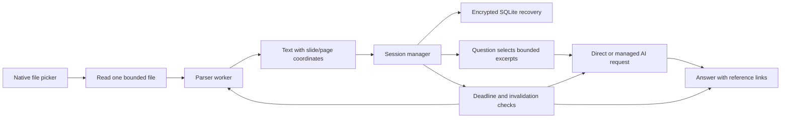

# Session materials: implementation and verification

## Where this work lives

Branch: `feature/session-materials`.

Development folder: `C:\Users\your-user\Desktop\NoCatch-session-materials`.

This branch starts from `test/root-kill-matrix` at `01a30e8` and includes the working changes that were present when this task began. Commit `35343ec` preserves that inherited working state before the feature changes. The original `NoCatch` checkout was left alone.

## What a user sees

1. First-time setup has an optional **Add reference materials** button. Returning launches open the optional preparation window.
2. Choose exported Google Slides, PowerPoint `.pptx`, or `.pdf` files using the native file picker. There is no Google account connection in this release.
3. Each file gets its own result. Preview extracted slide/page text and PowerPoint speaker notes. A failed file does not discard the other files. Partial extraction warns that visual information may be missing.
4. Tick the sharing checkbox and press **Start session**. Importing and previewing happen locally; relevant excerpts can be sent to the selected AI service after this action.
5. The window shows the remaining time. Typed questions, voice transcripts, screenshots and setup questions use the same reference rules.
6. Answers show **Reference excerpts sent**, with real deck/page coordinates that open a text preview. The AI receives instructions to cite supplied material and distinguish general knowledge. The source bar identifies what was sent; it does not claim every excerpt was used by the model.
7. Remove a file or end the session whenever needed. Those actions clear material-related answers, previews and pending work. The original files remain in their original locations.

Skipping is allowed. Preparing files expires after **30 minutes**. Starting creates one **90 minute** deadline. Reopening, adding files, removing files and pressing Start again never renew that active deadline.

## How the engineering works



The session manager owns the files, consent, deadlines and revisions. A revision is a number that changes when the references change. Every request remembers the revision it started with. An old response cannot reappear after a removal, expiry or account change.

Extraction runs in a worker thread so ordinary parsing does not occupy the Electron main thread. Files are read one at a time. PowerPoint slide order follows the presentation's relationships, including text, tables and speaker notes. PDF extraction reads embedded text. There is no OCR or chart interpretation. A scanned PDF may contribute no useful text, and that is visible.

The AI receives selected excerpts rather than all ten decks on every question. Search is local and uses words from the question to rank pages. It retains page coordinates and takes a bounded excerpt around relevant text. For screenshots, the first AI stage reads the question/concepts, then the second stage answers with selected references. Image questions require Gemini; DeepSeek is rejected explicitly for those requests.

There is no vector database or separate indexing service in this release. At this scale, bounded local retrieval avoids another durable copy and another service to operate. This is a deliberate first retrieval implementation; semantic search quality has not been measured against a live answer benchmark.

### Storage

`session-materials.sqlite` lives under Electron's `app.getPath('userData')`, including the application's existing separate root-mode profile when applicable. It is app-managed data; uploaded originals are never copied into that folder.

SQLite holds one encrypted session payload containing names, extracted text, notes and coordinates. A fresh random key encrypts that payload using AES-256-GCM. Electron `safeStorage` wraps the key using the operating system. The database contains a hashed owner, session identifier, state and deadline outside the ciphertext so expiry and ownership can be checked **before** decrypting content.

If secure operating-system storage is unavailable, or Linux reports the weak `basic_text` backend, the app reports **Memory only**. It does not silently save plaintext references. Closing then loses the prepared materials.

Search data, reference-derived conversation and setup drafts stay in memory. Existing ordinary chat storage remains available before references are used. Once a renderer has seen a material session, it keeps conversation memory-only until that renderer restarts; ending references does not accidentally persist the conversation it already saw.

### Limits and memory

| Resource | Enforced limit |
| --- | --- |
| Accepted files | 10 |
| One source file | 50 MiB |
| All accepted source files | 250 MiB |
| Slides/pages in one file | 250 |
| Slides/pages in a session | 1,000 |
| Decoded text in one file | 4 MiB |
| Decoded text in a session | 16 MiB |
| PowerPoint archive | 5,000 entries; 128 MiB inflated total; 8 MiB per entry; compression ratio 1,000 |
| Extraction | One import at a time; 60 seconds per worker |
| Worker JavaScript heap | 256 MiB old generation; 32 MiB young generation |
| Reference request | Up to 8 sources and 24,000 characters |
| Combined text prompt | 32,000 characters, including references and bounded history |
| Pending managed cleanup | 64 metadata records; 64 KiB file |

Capacity grows as files are added, up to these limits. Removal and failed imports free accepted capacity. Content hashes deduplicate renamed copies. Busy imports reject another queued import instead of building an unlimited queue.

The source-byte allowance is not the memory allowance. Original file buffers are used during parsing and then released; extracted text is retained. V8 heap limits do **not** impose a hard ceiling on native memory or total process RSS. The roughly 6,000-token reference estimate uses characters divided by four; the enforced request bound is characters, not an exact model tokenizer count.

## Expiry, failure and cleanup

While the app is running, expiry stops workers and requests, rejects late chunks/final answers, removes local reference access, clears material-related UI/history, and deletes the saved encrypted row. The in-memory session key is overwritten before it is released.

If the app is closed, no process is available to delete its database at minute 90. The next launch checks the original deadline and clears expired data before asking the OS to unwrap a key. This feature does not install an always-running service or scheduled OS task.

SQLite uses `secure_delete` and the DELETE journal mode. This removes the app's recoverable database content in the normal path. It is not a forensic secure-erasure guarantee for SSDs, backups or filesystem snapshots.

### When Windows refuses deletion

Before deleting, the store writes a small content-free `session-materials.cleanup` marker. If the database is locked, it falls back to memory-only operation, reports pending cleanup, and retries every 30 seconds. A saved marker prevents an ended session from being restored after a restart, before decryption is attempted.

If database deletion, file deletion **and marker writing all fail**, immediate local access still stops, but the recovery block cannot be saved. The UI explicitly asks the user to keep the app open until cleanup succeeds. A forced exit in that condition can leave an unexpired encrypted payload recoverable on restart. No implementation can persist an invalidation on a filesystem that rejects every durable write; this case is reported rather than described as successful deletion.

### When managed cleanup cannot reach the server

The managed server keeps material-derived answer text/events in bounded RAM. Its SQLite request ledger retains content-free status/quota/idempotency metadata. Those temporary answers are unavailable after a server restart, session expiry, end, or acknowledged reference revision.

The client saves failed revision/end operations to `material-cleanup.json`. That file contains only session IDs, original deadlines, revision numbers, operation types and a deployment-bound hashed owner. It never contains slide text, file names, answers or tokens. End wins over a revision, newer revisions win over older ones, and deadlines cannot grow.

Delivery retries while the app runs, and again when the same account signs in. It never sends one account's cleanup under another account's credentials. One failed delivery stops that drain; retries do not spin. Expired records are discarded because the server's original deadline already applies. If queue persistence fails, the UI reports that retry metadata is memory-only.

An offline client cannot promise immediate remote revocation. Local access stops immediately; remote answers may remain until cleanup is acknowledged or the original deadline arrives. The selected external AI provider's own retention policy also applies to excerpts already sent to it.

## Scenarios considered

| Scenario | Implemented behavior |
| --- | --- |
| Five decks initially, five added later | One session, bounded capacity, original active deadline preserved |
| One deck is corrupt | Individual failure; other valid decks remain usable |
| Same deck renamed | Content deduplication |
| Import is cancelled or preparation expires | Worker abort and late-result rejection |
| Files change during reading | Bounded regular-file read with size/time checks |
| A path is a directory or FIFO | Reject without an unbounded read |
| Slides are image-only or contain charts | Partial/empty text coverage warning |
| Answer is absent from references | General knowledge allowed and instructed to be clearly distinguished |
| A slide contains instructions to the agent | Encoded as untrusted reference data, not system instructions |
| Removal occurs during an answer | Revision change aborts/discards old output and clears source UI |
| Preview replies arrive out of order | Request revision prevents an older page/citation from overwriting the newer one |
| App reopens before expiry | Same-owner encrypted recovery, original deadline |
| App reopens after expiry | Cleanup before decrypting |
| Account or AI mode changes | Clear material-related work and context |
| Server disconnects during removal | Visible pending cleanup and owner-bound metadata retry |
| Server restarts | Temporary material answers cannot be replayed from disk |
| Disk or compositor fails during QA | Retain failed evidence; distinguish environment failure from a product assertion |

## Verification obtained

Independent QA authored the acceptance checks; production builders did not edit them. Frozen source manifests detect persistent changes to those checks. These are cooperative hash checks, not an OS security boundary.

| Gate | Result |
| --- | --- |
| Material extraction, lifecycle, providers and main integration | 103/103 |
| Inherited regression suites | 107/107 |
| Revision revocation, post-expiry reuse and bounded FIFO read | 5/5 |
| Provider expiry-at-stream-end and image-provider validation | 6/6 |
| Cleanup failure, restart, account isolation and queue bounds | 7/7 |
| Simultaneous marker-write/delete failure status | 1/1 |
| Real main mutation replies retain server cleanup status | 1/1 |
| Native Windows materials screen | 8 checks |
| Native Windows chat privacy/source screen | 8 checks |
| Native preview/source race journeys | 5 checks |
| Native cleanup warning transitions | 3 checks, with readable screenshot |
| Native full main with real IPC, parser workers and safeStorage | 7 checks; first/returning launch also exercised |
| Required packaged files and native dependencies | 18/18 |
| Actual packed main/parser/encrypted-storage journey | 7/7 |

The workload used **10 distinct real PPTX files, 60 slides each**, with text, notes, tables and some visual-only slides. It imported five, then another five, and retrieved a unique fact from deck 10, slide 55 with the correct source coordinate.

Measured once: **3.65 seconds total**, **113.3 MiB sampled peak process RSS**, and about **6 milliseconds retrieval**. The decks totalled about **1.7 MiB** of source bytes and **530 KiB** extracted text. These are fixture measurements, not a worst-case memory guarantee or a promise for ten large media-heavy decks.

The actual electron-builder archive and the separately repacked final source archive passed required file/native-dependency inspection and isolated Electron main/worker execution. No claim is made for a completed installer, signing, normal packaged-executable integrity/startup, elevation, live recording, Google OAuth, or live-provider answer accuracy. All provider calls in QA were controlled fixtures or local HTTP.

### Reproduce the checks

See [the QA guide](../scripts/materials-qa/README.md). From this folder, use Node 24 or newer for automated tests:

```sh
node scripts/materials-qa/run.cjs hashes
node scripts/materials-qa/run.cjs test
node scripts/materials-qa/run.cjs regression
node scripts/materials-qa/supplemental-v5/run.cjs
node scripts/materials-qa/supplemental-v6/run.cjs test
node scripts/materials-qa/supplemental-v8/run.cjs
node scripts/materials-qa/supplemental-v9/run.cjs
```

Generate fixtures first when needed, following the QA guide. The FIFO check requires Linux; Windows does not support that fixture. Frozen v4 remains as historical failed-environment evidence; v5 is the corrected Linux `/tmp` fixture.

For the development app, open this worktree in a Windows terminal and run `npm start`. Dependencies and a standalone Electron 44 development runtime are installed in this worktree. Speech runtime setup/build continues to use the project's existing workflow; its large generated bundle was not duplicated permanently into this checkout.

Local evidence is under `C:\Users\your-user\Documents\NoCatch-session-materials-evidence-20260929`. Generated fixtures, screenshots, reports, temporary profiles and archives are excluded from the feature commit. The committable QA scripts and frozen manifests are included.

## Main implementation files

- [Session ownership, deadlines and retrieval](../src/materials/index.js)
- [Encrypted SQLite and deletion recovery](../src/materials/store.js)
- [PPTX/PDF extraction worker](../src/materials/extract-worker.js)
- [Shared request/reference contract](../src/materials/context.js)
- [Answer routing and cancellation](../src/services/materials-routing.js)
- [Managed cleanup outbox](../src/managed/material-cleanup.js)
- [Server lifetime enforcement](../server/app.js) and [temporary answer storage](../server/store.js)
- [Preparation screen](../materials.html) and [screen behavior](../src/ui/materials.js)
